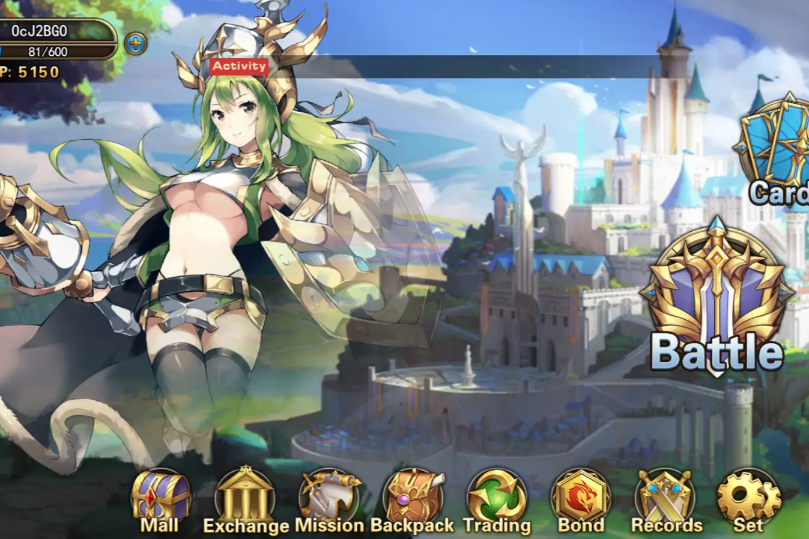

# X World games

X World Games 是下一代去中心化区块链游戏生态系统。 “X World”代表着一个未知的宇宙有待探索，而“游戏”则代表着更多的游戏将被添加到这个生态系统中。 X World Games的愿景是构建一个连接传统游戏玩家和区块链世​​界的多元化游戏生态系统，帮助更多想要进入加密空间的游戏开发者创建底层区块链框架。 X World 游戏的使命是将区块链技术带入一个开放的游戏世界，来自世界各地的游戏玩家可以一起参与游戏，包括 PvP 战斗、创建/收集卡牌。在 X World 游戏的 NFT 交易市场中，玩家可以自由买卖各种基于 NFT 的游戏内道具和装备。 X World 游戏将为该产品完成一个庞大的平台基础设施计划，包括游戏中心、NFT 交换、跨游戏协议端口和全功能游戏创建工具箱。同时，X World 游戏将通过发行更多游戏和签署更多正宗动漫IP，将迁移的游戏与预先建立的通证系统连接，引导玩家社区进行完整的DAO治理，从而丰富游戏生态系统和社区。 &nbsp; X World Games 是一个游戏平台，将区块链与来自传统游戏世界的数千名玩家连接起来。 X World Games目前正在与众多游戏开发商洽谈，以吸引更多的传统游戏玩家并扩大其生态系统，旨在成为区块链游戏领域的“公海”，成为区块链游戏中心

