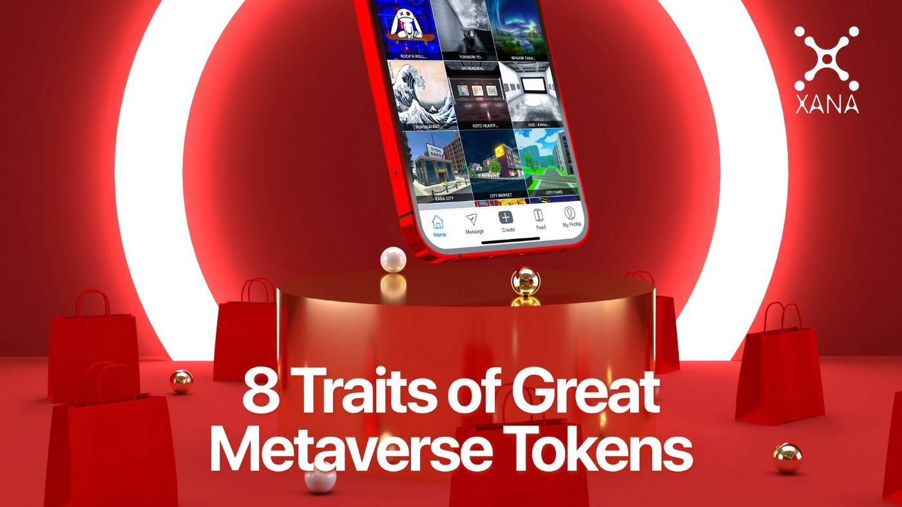

# XANALIA

元界最佳去中心化多链 NFT 市场，XANALIA 是基于 BSC、ETH 和 Polygon 的元界最佳去中心化 NFT 市场。它具有多种强大的功能，例如铸造 NFT、交易和拍卖它们。用户 IP 受到版权保护准则的保护。 XANALIA 市场与 Metamask、币安链钱包和许多其他移动钱包兼容。 XANALIA 旨在快速运行且每次操作的费用/成本便宜，允许 NFT 收集者以前所未有的方式与 NFT 进行交互。

随着关于元界的所有嗡嗡声，我们在这里带来了当今所有元界代币所需的主要因素。

Metaverse 是一个虚拟世界，预计将与这个现实世界平行运行。首先，它是一个虚拟世界，您可以在其中工作、玩游戏和观看电视节目或电影。您还可以享受虚拟音乐会以及参观艺术画廊。您可以在元宇宙中做的事情有无数的机会。但是，您肯定需要某种形式的加密货币来促进支付，而这正是您需要元界代币的地方。

Metaverse 代币是虚拟货币的单位，可用于在 Metaverse 内进行数字交易。他们有权让您完全按照普通法定货币在这个现实世界中允许您做的事情。这些供应有限的加密代币以区块链技术为后盾。例如，您可以使用元界代币 $XETA 在 XANA 元界上购买一块虚拟房地产。逐渐地，当平台用户拥挤时，您可以将其借给某人开设虚拟商店。

