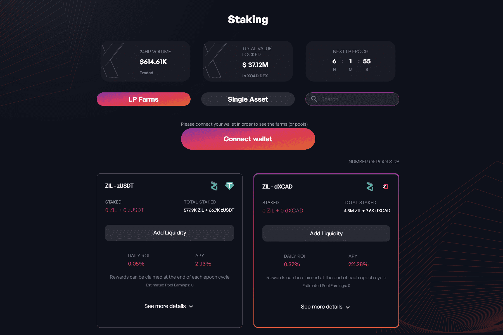

# XCAD

XCAD Network 是一个通过 Creator 标记化利用 Content Creator 观众价值的平台，观众获得用于粉丝治理的奖励。

我们当然已经跳过了一些障碍来达到这一点，但是我们很高兴现在宣布 Transak 的合作伙伴关系/整合已经完成！

用户将能够通过 XCAD 网络插件使用信用卡/借记卡或 Apple/Google Pay 购买 XCAD，从而简化用户购买 XCAD 或 Creator 令牌的流程。

大多数项目以用户购买代币并从公司金库中取出代币的方式设置网关。 XCAD 没有必要这样做，它与 Transak 建立了网关，当有人购买 XCAD 时，它实际上是直接从 KuCoin 的订单簿中购买，从而产生购买压力并减少市场供应。

我们认为与 Transak 的合作将为 XCAD 生态系统增加巨大的价值，并且是我们朝着 web2 到 web3 大规模采用的愿景又迈出了一步。

