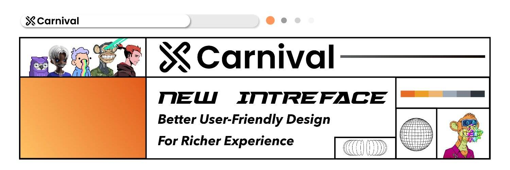

# XCarnival

XCarnival是多链环境下稳定安全的金融基础设施协议，为Web3.0中的NFT资产提供市场优化的流动性解决方案，支持P2P（Person-to-Person）和P2C（Instant Lending Pool）两种模式资产支持贷款。
XCarnival解决方案1.0——XBroker
XBroker是一个NFT质押借贷平台，为NFT市场提供流动性。参与者分为三个角色：抵押人、贷方和清算人。抵押人是提供NFT来质押和借钱，贷方通过借出USDxc获得利息，清算人通过竞拍参与清算，即支付拍卖价格获得NFT。
XCarnival解决方案2.0——XPawn
XPawn 是一个基于以太坊主网上发行的 NFT 资产，创新使用矿池模式，借出价值币的平台，用户可以作为存款人或借款人参与其中。储户向借贷池提供 ETH 等流动性以赚取利息和奖励，并获得流动性激励。借款人可以使用其持有的 NFT 作为抵押品，将 ETH 等借给贷款池。

