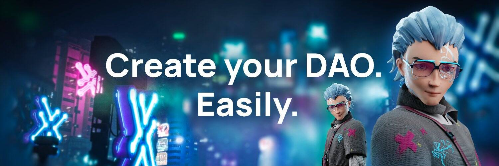

# XDAO

XDAO – 扩展的多链 DAO 生态系统是为去中心化的未来而构建的。这个项目的背后是一支高素质的团队，拥有强大的加密背景。 XDAO 已在 Ethereum、BSC、Polygon、HECO 上成功推出，并将进一步扩展到更多区块链。 XDAO 的主要思想是允许人们创建一个任意规模的去中心化自治组织。 XDAO 正在致力于提供一种产品，通过为其提供成功运营所需的所有工具，揭示公司在区块链上的全部潜力。对于更精明的用户，XDAO 也可以被描述为具有链上执行的链下投票机制。 XDAO 团队是 BSC 黑客松、HECO 黑客松的获胜者，并在 2021 年夏天获得了 Polygon 的资助。
是什么让 XDAO 与其他 DAO 构建器不同：

  模块化结构（你想在你的 DAO 中拥有的一切都可以通过模块来实现：快照集成、时间锁控制器、语音委托等）。
  混合投票（更便宜、更快的投票）。
  通过 Wallet Connect 与 DeFi 直接交互。
  DAO 生态系统，投资者可以在其中进入、分析和投资最具前景的项目。

XDAO 可以做什么：

  DeFi 项目资金团队管理。
  任何区块链组织的工资库/营销库。
  授予程序/错误赏金
  与相互投资 DeFi
  投资 NFT 和
  慈善机构。
  共同参与任何分配、IDO 或 Launchpad。
  家庭财务管理和许多其他用例。

