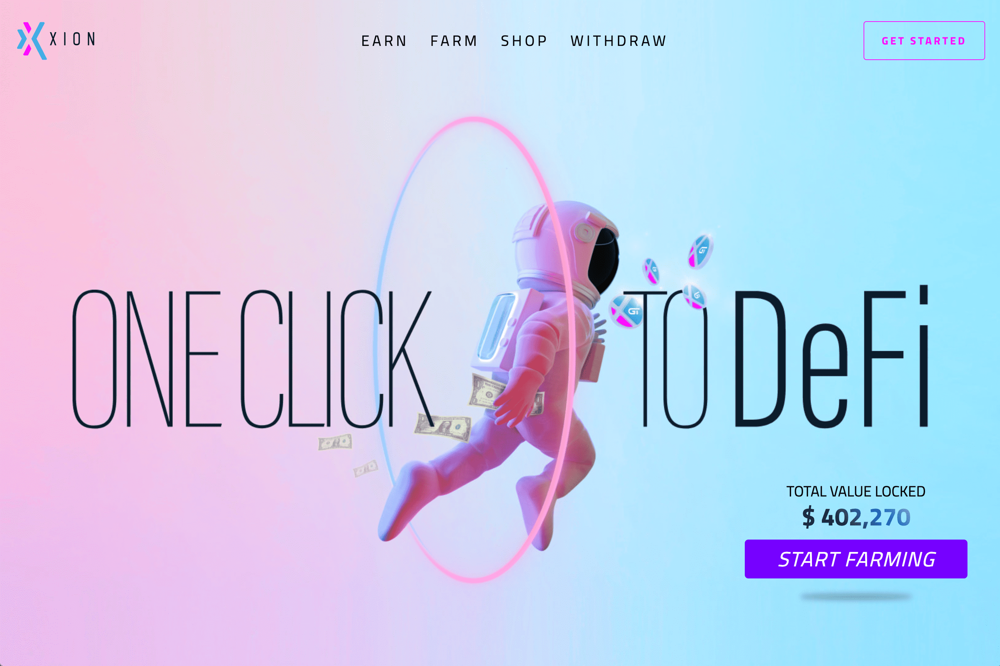

# Xion Finance

Xion Global 通过结合 3 个去中心化应用程序创建了一个电子商务和 DeFi 生态系统。名为 XGT 的跨链代币可用于单产、处理电子商务支付、铸造奖励和简单的价值转移。最大供应量设定为 30 亿个代币。
Xion Global 特点：

  面向商家和客户的去中心化电子商务平台
  用于电子商务购买、折扣和现金返还的去中心化托管结账
  Xion Finance DeFi 应用挖矿，赚取利息和奖励
  跨链网络卸载成本密集型交易

为了资助开发，Xion Global 项目从天使投资/VC（CV Labs）筹集了 300,000 美元，并从 Xion Global 创始人那里筹集了 250,000 美元的额外资金。
Xion Global 旨在通过为电子商务支付、奖励和财务激励提供易于访问、可扩展且具有成本效益的生态系统来“帮助企业家实现财务独立”。
以太坊主网和 xDAI 链之间已经开发了各种跨链机制，以使 XGT 所有者受益于低成本交换、有吸引力的流动性挖矿、购买力以及即将对软件进行拟议更改的权利。
与传统代币交易相比，使用 XGT 进行支付的流程更加有效和用户友好，因为流程中简化了代币限额等功能。

