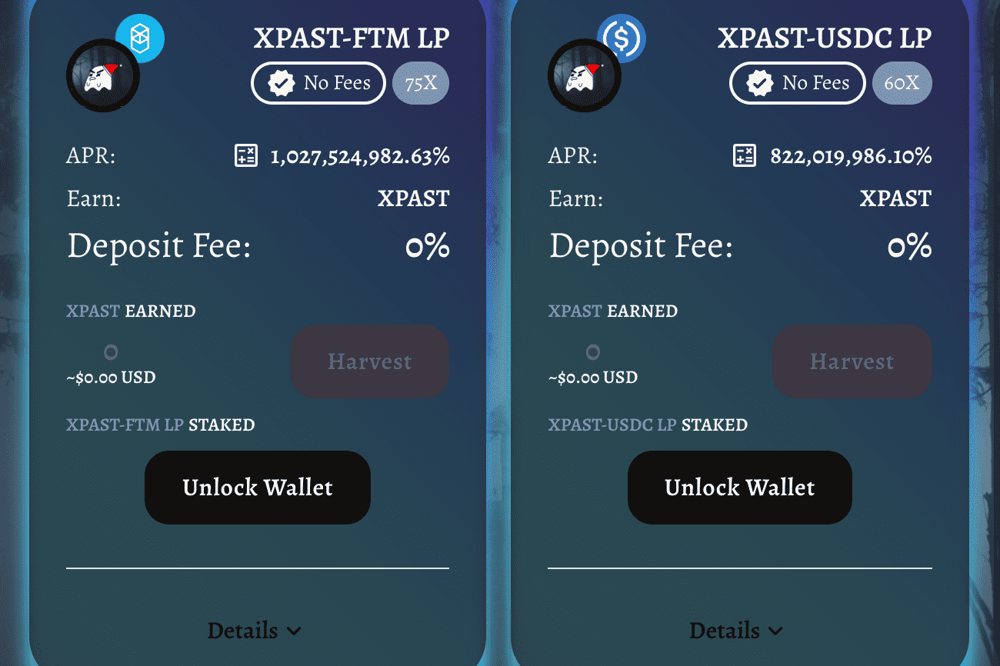

# Xmas Past

XMAS PAST 的由来
受到查尔斯狄更斯“圣诞颂歌”的启发 - 圣诞节过去的幽灵，连同 Fantom 生态系统，并与即将到来的欢乐圣诞节保持一致，我们带来了 XMAS PAST 的外观。
圣诞节过去的幽灵
圣诞颂歌讲述了 Ebenezer Scrooge 的故事，他被圣诞节的三种精神——过去、现在和未来的圣诞节精神所拜访。圣诞节过去的幽灵是一个奇怪的，超凡脱俗的人物，像蜡烛一样闪耀和暗淡，总是改变它的外观，因为它反映了斯克罗吉对远古时代的记忆。这种精神代表了当前对斯克罗吉的赎回机会。

圣诞节过去
放眼来看，我们的 XMAS PAST 将老式的单产农业模式带入了现代。它为我们提供了从现实生活中的财务困境中解脱出来的自我，通过安全和优质的单产农业体验在这个欢乐的季节传播快乐。
本质上，XMAS PAST 是基于 Fantom 生态系统的产量农业协议。

