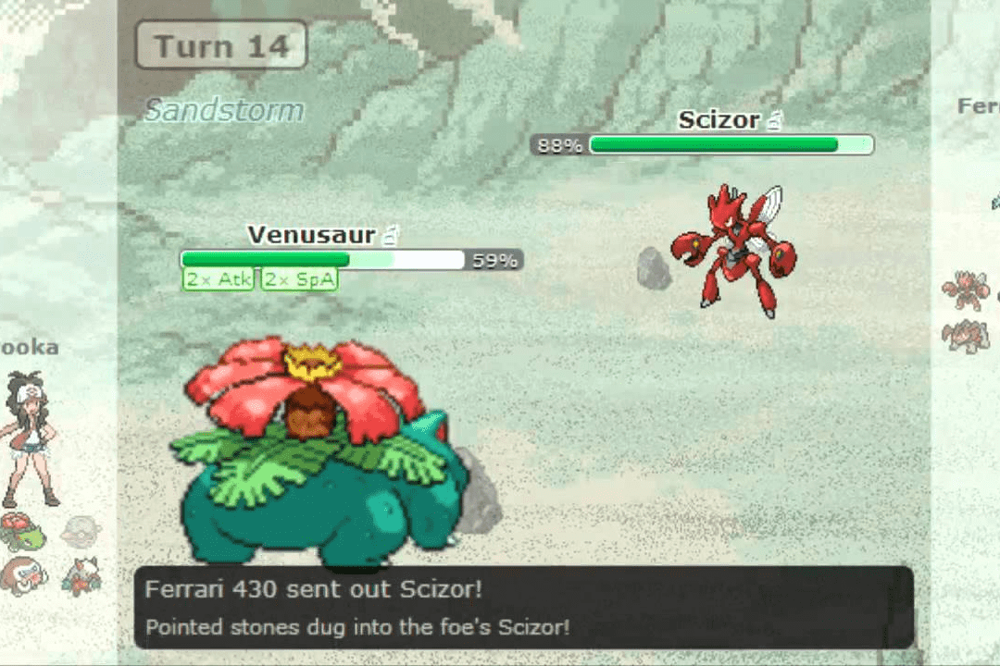

# xPOKE

PlayToEarn，受 Axie Infinity 启发，在传统游戏中实现。
Pokémon Showdown 服务器的服务器内货币（拥有自己的货币的服务器，即使是 xPOKE 无法控制的），可转换为它们的“包装/挂钩”/标记化形式 (xPOKE)。
xPOKE 使用以太坊的 layer2 XDai 网络。
可以铸造代币的 DAO 已经有点去中心化了，它的铸造能力被授予多重签名 Gnosis 保险库（热钱包也是多重签名，但不如保险库多重签名安全，但持有的金额也更少，正如热钱包所认为的那样）。很快它将变得更加去中心化，聊天机器人作为预言机，智能合约自主负责铸造。未来它也可以在 Golem 网络上完全运行。
很快，服务器内的物品（昵称效果、培训师卡效果、氏族等）将作为 NFT 配对。
免责声明：xPOKE 和“以太坊”神奇宝贝对决服务器与 GameFreak、任天堂、神奇宝贝公司或以太坊区块链没有任何关系。 xPOKE 和“以太坊”PS 服务器（截至 Pokémon Showdown）是粉丝制作的项目。这是一个非盈利项目。

