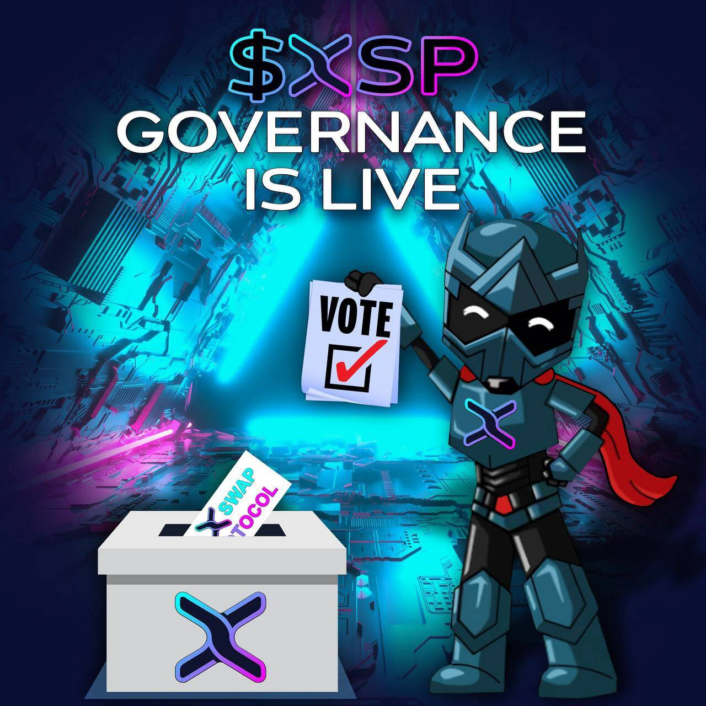

# XSwap Protocol

XSwap 协议是 XDC 网络中的第一个 AMM 和 DEX，它允许在安全平台上交易 XRC20 代币。
XSP 是项目的原生代币。它将用于：
质押和农业奖励。
在治理平台上投票。

如今，大多数 DeFi 项目的焦点是治理代币的存在。它们被认为是一切去中心化事物的基础。在没有这些代币的情况下，开发人员将无法自豪地说他们已经建立了一个比中心化交易所 (CEX) 更好的真正去中心化平台。

为了成为 XDC 区块链中完全去中心化的交易所，XSwap 协议已经发布了他们的治理令牌 XSP。他们也刚刚启动了他们的治理平台。这符合团队促进包容性并使其代币持有者能够在平台的未来发表意见的计划。代币持有者现在将通过持有、质押或耕种 XSP 对项目的运行方式发表意见。

XSwap 最终由其社区通过论坛讨论进行管理，并在适当的时候对有关 XSwap 治理的提案进行投票。

只有团队成员可以发布关于 XSP 治理的提案。

重要的是要注意，一旦核心团队创建了治理提案，任何转移到另一个钱包的代币都不再计入投票。这消除了某人将代币从钱包转移到另一个钱包以获得更多选票的可能性。每个 XSP 代币相当于 1 票，您可以从提供的选项中选择 1 个选项。投票结束后获得最高票数的选择获胜。

