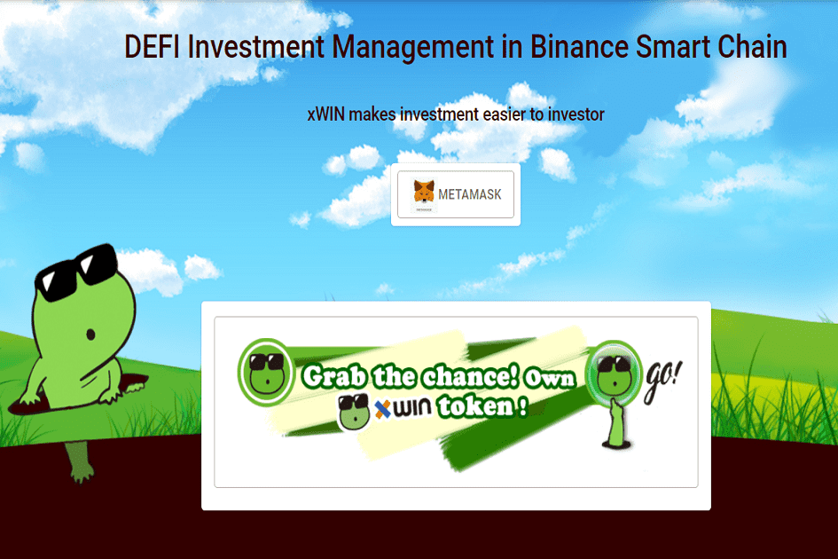

# xWIN Finance

xWin是采用币安Smart Chain区块链技术打造的资金管理平台。它为基金经理提供了轻松启动基金并轻松连接投资者的机会。

  xWin在币安智能链中提供一系列板块指数基金。我们包括 xWIN BSC Defi 指数、xWin Binance-Peg Infra 指数和 xWin US-ANTG 指数。将会有更多的扇区金库到来
  xWin LP Vault 是一个帮助农民（投资者）将其代币作为流动资金池质押到 Pancakeswap 并使用 LP 代币进行耕作的保险库。投资者不必担心如何添加或删除流动性和耕作过程，而是让基金为您自动完成这一切。
  xWIN Trading Vault 的行为类似于指数保险库，但交易频率更高，少数资产之间的分配将根据交易趋势和动量进行重置。金库可以由基金所有者控制，也可以根据技术分析信号自动控制。
  xWin 允许用户种植他们的 xWin 代币或 xWin Vault 代币以赚取更多的 XWIN 代币作为回报。除了让专家管理您的代币外，您还可以赚取 XWIN 代币，只要您订阅任何一个 xWIN 基金

