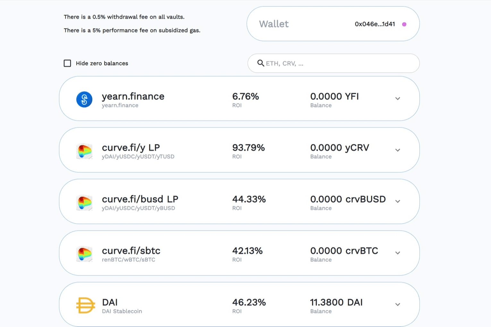

# yearn.finance (YFI)

yearn.finance 是一个去中心化收益聚合器，它利用 Compound、Curve、Aave 等其他去中心化金融服务来优化您的代币借贷。它将您的存款分配到收益最高的平台，并允许您赚取 yToken。它支持多种稳定币，如 DAI、USDC、USDT、TUSD、sUSD 等，也支持 LINK 等其他代币。

Yearn 的核心原则之一是对混乱的健康尊重。毕竟，伊恩是从混沌中诞生的。一个大爆炸的时刻，一个零对一的动力超级碰撞，催生了一种全新的收益聚合器。虽然有些人担心混乱，但我们知道它可以创造新的想法，甚至催生整个行业。

“品牌”不能安于混乱。品牌要求一致性，它要求结构，并带着一个马尼拉文件夹整齐地夹在它的胳膊下。

一个无头的组织怎么能凝聚成一个单一的品牌？它不能。这是一个矛盾。

