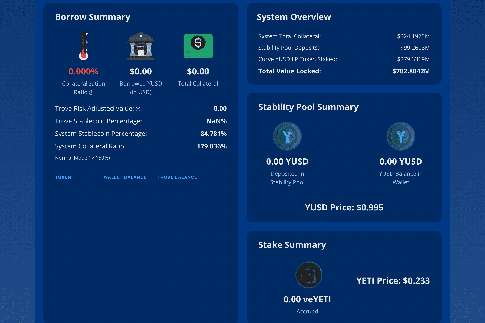

# Yeti Finance

Yeti Finance 是一种基于 Avalanche 的尖端去中心化借贷协议，允许用户以 LP 代币、Liquid AVAX 等质押资产和 WETH 等基础资产借入高达 11 倍的利率，以及 20 倍以上的收益稳定币，所有利率均为 0%利率。
当这些资产存入 Yeti Finance 的平台时，用户将继续获得耕作和质押奖励，从而开启了许多杠杆耕作策略。
借款人以 1 YUSD 对 1.1 USD 的最低比率获得 YUSD（一种超额抵押的美元稳定币）。然后，用户将能够使用 YUSD 购买额外资产、对冲头寸或提供流动性以获得额外奖励。
在任何时候，1 YUSD 都可以赎回 1 美元的基础抵押品。 Yeti Finance 以 Liquity 的经济模型为基础，以确保挂钩稳定和高效清算。
Yeti Finance 还提供交叉保证金，这是大多数借贷协议所没有的。简单来说，Yeti Finance 上的用户可以在他们的整个投资组合上开设借款头寸，而不仅仅是单一资产。
交叉保证金使针对波动性资产的借贷更加安全，因为多种资产可以作为您贷款的抵押品，而不仅仅是一种，从而大大降低了因资产波动和闪崩而导致的清算风险。
Yeti Finance 在稳定币/借贷领域实现了巨大的飞跃。

