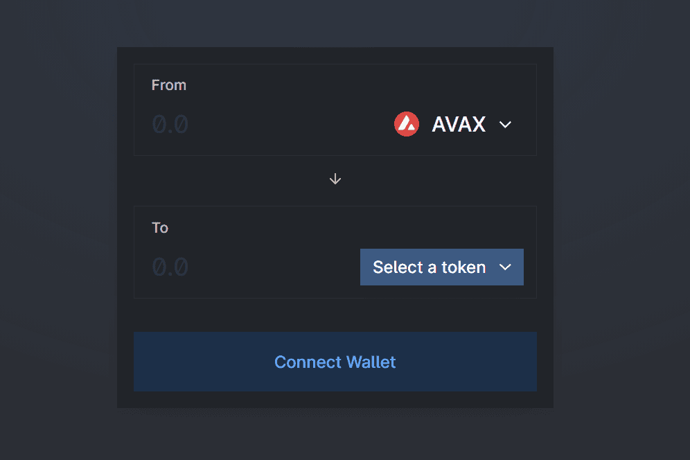

# Yeti Swap

YetiSwap 是在 Avalanche 上运行的去中心化交易所 (DEX)，使用与 Uniswap 相同的自动做市 (AMM) 模型，具有称为 YTS 的本地治理代币，该代币完全社区分布，能够交易在以太坊和 Avalanche 上发行的所有代币.在一个拥有多个竞争者的拥挤市场中，YetiSwap 提供了三个至关重要的好处：快速廉价的交易，以及公平和公开的代币分配。首先，YetiSwap 可以快速且廉价地完成交易。由于 YetiSwap 建立在 Avalanche 之上，它使用户能够交换资产，同时享受亚秒级的交易终结性和低至几美分的交易费用。通常，YetiSwap 上的交易感觉与中心化交易所的交易一样快。二是性能大幅提升超越技术现状。现有 AMM 的用户，例如 Pangolin、Uniswap 和 Sushiswap，已经熟悉它们的作用机制。因此，本文的其余部分不讨论 YetiSwap 如何实现其交易能力。相反，我们更详细地讨论了 YTS 代币，包括其分配机制和治理规则。

