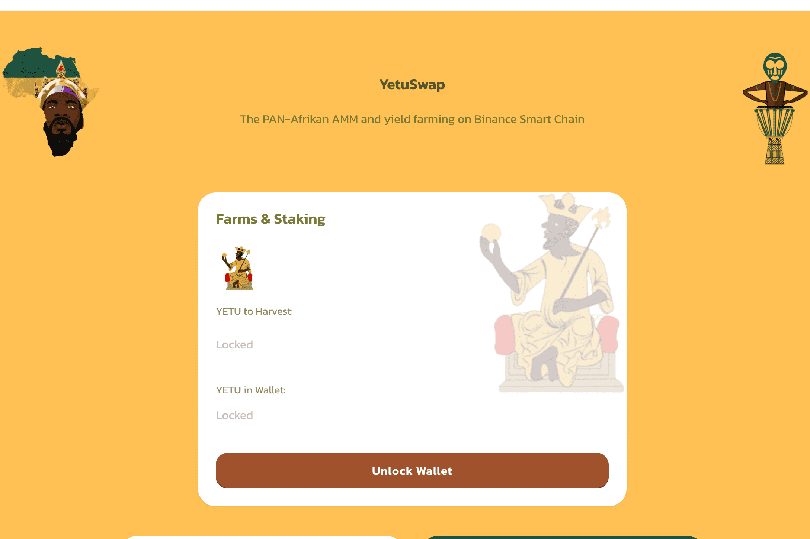

# YetuSwap

YetuSwap 是基于币安智能链的泛非去中心化协议。 YetuSwap 拥有自己的治理资产 YETU 代币，用户可以使用它对不同的平台提案和协议变更进行投票。
社区可以在 YetuSwap 上耕种和质押，我们将很快推出 NFT 市场和彩票。

我们向整个社区宣布，为我们的 Yetoshi Wakanda 俱乐部 NFT 集合选择的区块链是以太坊。在众多选择中，我们认为以太坊是扩展我们 NFT 集合的合适网络。

正如宣布的那样，我们必须在 Binance Smart Chain、Ethereum 或 Solana 之间进行选择才能推出我们的 NFT 集合。但是，我们想要一个可在 OpenSea 上使用的可扩展网络。

Solana 是首选网络，然而，在两周前 Solana 网络钱包遭到攻击后，我们不得不重新考虑并选择了以太坊，因为它是一个更安全的网络，并且错误或中断更少。

我们将在即将公布的日期在以太坊网络上推出 NFT 集合，很快我们将在社交媒体上进行几次抽奖活动。此外，Yetoshi Wakanda 俱乐部收藏网站正在建设中。

在所有网络上关注 Yetoshi Wakanda 俱乐部并加入我们的 Discord 小组。

