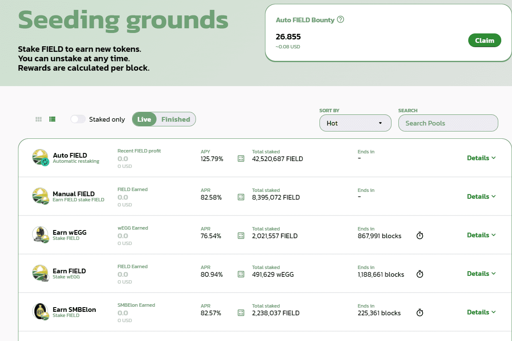

# Yield Fields

Yield Fields是一款在平衡计分卡上运行的DEX，由2014年货币货币单位背后的加密团队设计和推出。
Yield Fields为用户提供超过300%+的收益，并提供我们的原生代币FIELD的自动质押，已经将自己确立为一个令牌交换，质押池收益农业DEX平台，您可以信赖。
加入我们，看看有哪些出色的投资回报率BSC DeFi DEX用于代币掉期，质押，流动性和收益农业此数据表示跟踪的智能合约的原始链上活动

