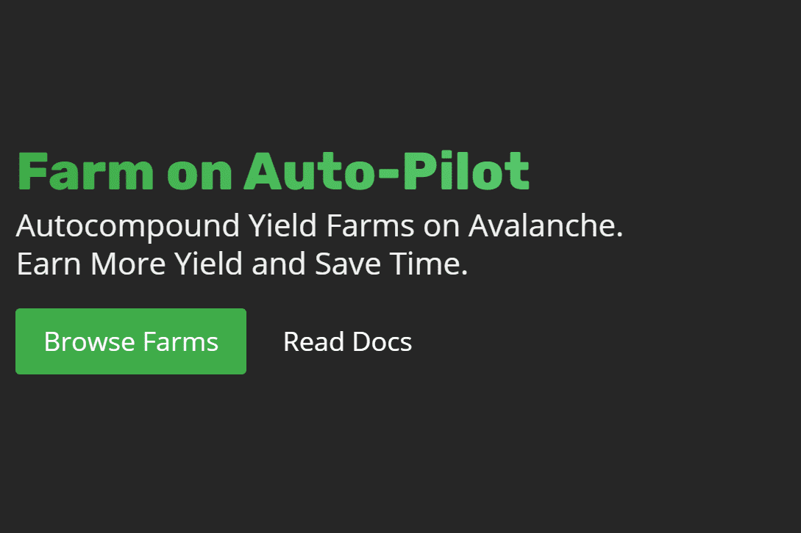

# Yield Yak

牦牛的产量是多少Autocompounder产量牦牛是一种易于使用的工具，可通过雪崩网络上的defi耕作获得更多产量社区驱动产量牦牛是一个社区驱动的项目。我们的社区建立并维护了市场上最好、最便宜和最多样化的自动复合器自给自足产量牦牛基本上是自给自足的。我们的社区提供复合奖励、建议新策略、建议关键配置更新并为开发做出贡献。产量牦牛农场可以在没有团队参与的情况下永远运行。#牦牛的产量如何？产量牦牛自动复合物产量农场奖励。*每个农场都是收益牦牛用户的存款池*农场赚取奖励代币（如PNG）*农场将所有奖励重新投资，使每个人的存款复利。所有储户都从收益牦牛复利的非常高频率中受益。

