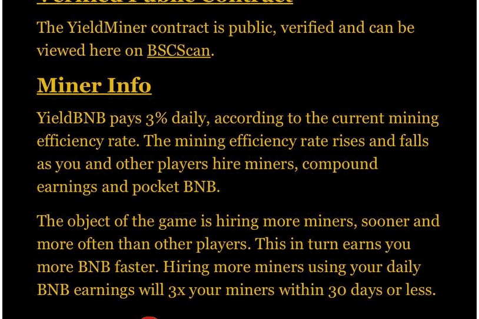

# YieldBNB

如何使用YieldBNB开采BNB
雇佣矿工＞矿工寻找BNB＞复合＞退出＞利润！
步骤1.使用BNB雇佣矿工。
第2步：你的矿工将开始挖掘，将他们发现的BNB放入你的桶中。您可以使用桶中的BNB来增加您的BNB采矿生产率，即“雇佣更多矿工”。
步骤3.或者，您可以将BNB放入桶中，您的矿工将再次开始填充桶。
矿工们将继续不停地用BNB填充你的桶。为了您的方便，添加了24小时计时器，无需让松散的BNB长时间无所事事。您可以随时“雇佣更多矿工”或将BNB收入囊中，但建议至少每24小时一次。

