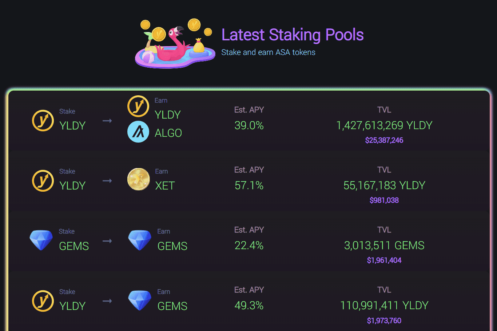

# Yieldly.Finance

Yieldly 是 Algorands 第一个也是最大的 Defi 协议。 我们的核心目标是让用户和项目能够在没有摩擦、gas 效率低下或安全风险的情况下交换数字价值。 Yieldly 的产品套件包括质押和流动性矿池、跨链交换、Algo 和 NFT 无损彩票。 我们将自己定位为生态系统领导者和孵化器，并不断将其产品扩展到治理、市场、启动板和 AMM 领域。Yieldly 正在重新构想如何在所有链上交换价值——在我们的愿景中，障碍将不存在。Yield 首先使用基于 Algorand 的 DeFi 无缝连接区块链世界。 为什么？ 因为与任何其他协议相比，Algorand 允许用户以更低的费用和更高的安全性更快地交易价值。

