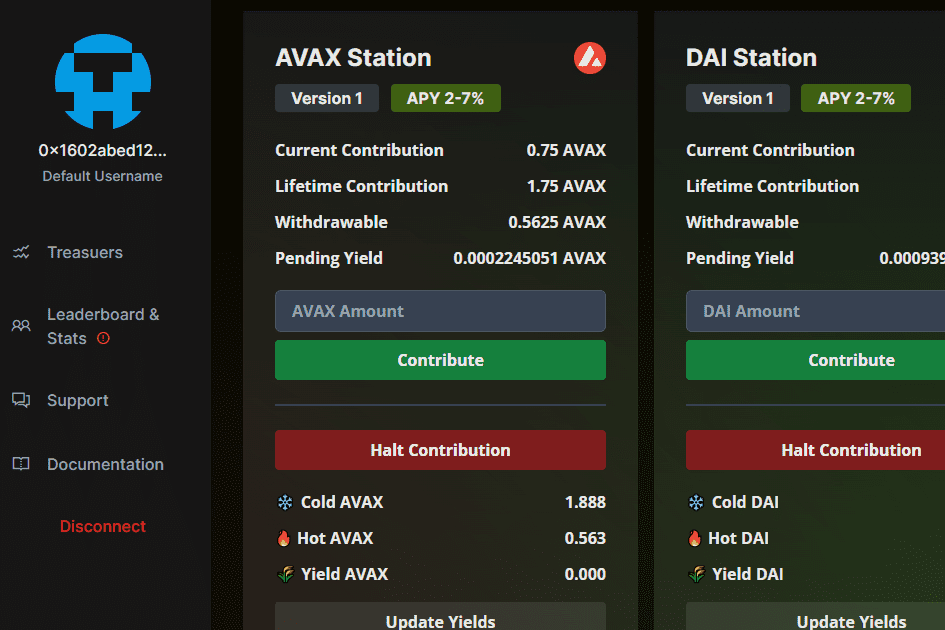

# YieldRise

YieldRise 协议是一个去中心化的合作收益平台，收益不断增加。用户可以作为协议贡献者参与并获得其加密资产的恒定收益，每个贡献者都会增加协议收益能力的规模，从而为协议贡献者产生更多收益。通过为协议做出贡献，您不仅可以获得收益，还可以确保协议的发展并利用以前贡献者的协议贡献！
每个站都处理自己的加密资产，并为该资产的贡献者产生收益。每个站由三个金库组成，冷库、热库和产量库。
冷库是协议的“永久”部分，即使每个贡献者都停止贡献并离开协议，这个库也会产生收益。每个新贡献的 25% 都存入冷库，一旦合同被放弃，绝对没有办法从这个库中删除加密货币。随后，每次工作站为其贡献者收集收益时，该收益的一部分 (10%) 都会存储在冷库中，从而进一步提高其收益能力。
热库是存入和提取当前捐款的地方。当做出新贡献时，75% 的贡献存储在热库中，热库也用于为贡献者和协议生成收益。一旦贡献者决定停止他们的贡献，他们的加密货币就会从热保险库中取出并发回给他们。
收益库是收集和存储收益的地方。一旦协议为贡献者产生了收益，收益就会被存入收益库，供贡献者在任何时间点提取。

