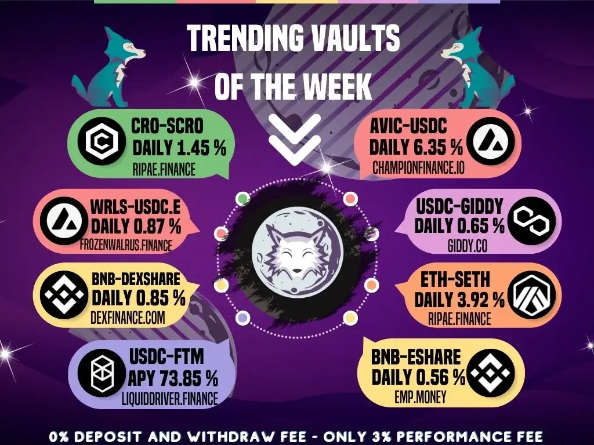

# YieldWolf

YieldWolf 是下一代 DeFi 自动化平台。 它有效地根据最知名的协议自动执行单产农业策略。 YieldWolf 通过以最优利率自动组合奖励并在池中的所有农民之间分配 gas 成本来增加潜在收入。YieldWolf 协议的创建是为了支持大量且不断增长的农场，以便您可以从您最感兴趣的项目中获得回报，但更有效、更公平。 Yield Wolf 智能合约以最优利率汇集多个用户存款和奖励，通常每隔几分钟。 通过将许多用户链接在一起，YieldWolf 可以以通常只对鲸鱼有益的高频积累。 通过这种方式，YieldWolf 帮助缩小了大玩家盈利能力与普通用户盈利能力之间的差距。

