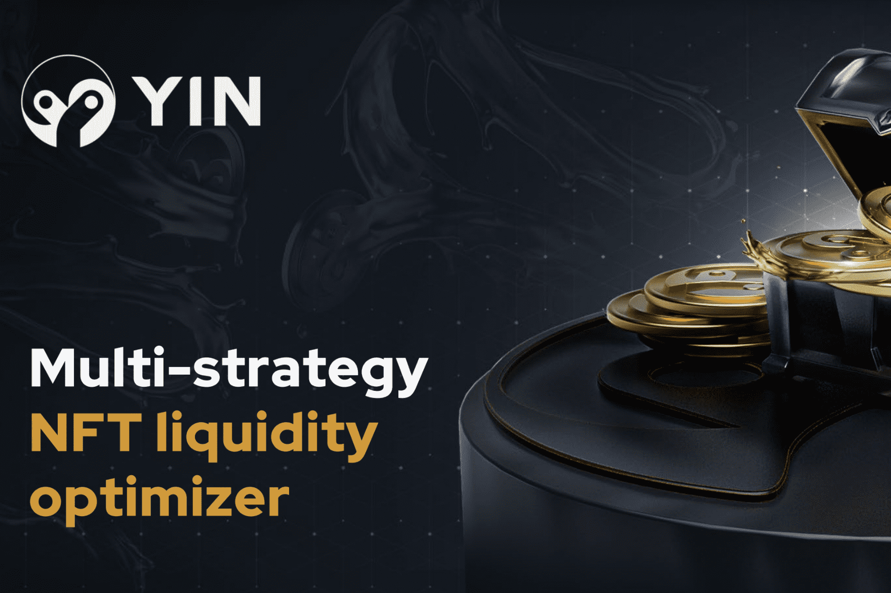

# YIN Finance

银金融是一个多策略的金融NFT资产管理平台，允许用户订阅项目的各种策略，以实现有效的高收益流动性管理。银金融旨在为不同的公有链和去中心化交易所提供主动的流动性管理服务。目前，YIN Finance已部署在Polygon和BSC上，并将很快部署在Solana上。很高兴向大家展示我们的新搭档
@银金融
谁将参加7月19日的冒险活动！
⛵️我们准备了丰厚的奖励，欢迎所有的黄金猎人上船。
👀请务必关注他们的最新消息以获取独家邀请代码

