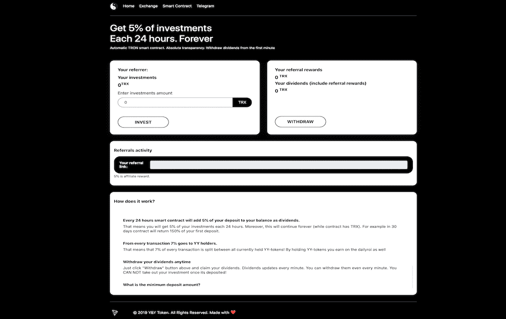

# Yin & Yang

阴阳是一个区块链管理的智能合约经济。共享您的主节点，构建您自己的网络和基于容量的通用奖励。建立在Tron网络上***YY交易所***：每次买入收取15%的费用，每次卖出收取30%的费用。费用将在所有当前持有的YY代币之间分摊，而不是去交易所！15%购买费的40%委托给推荐人***BTT DailyROI***：只要合同中有BTT，每天可获得2%的投资，并有7%的推荐奖励***TRX DailyROI***：如果合同中有TRX，每天可得到2%的回报，有10%的推荐回报和8%的转账到yy交易所

