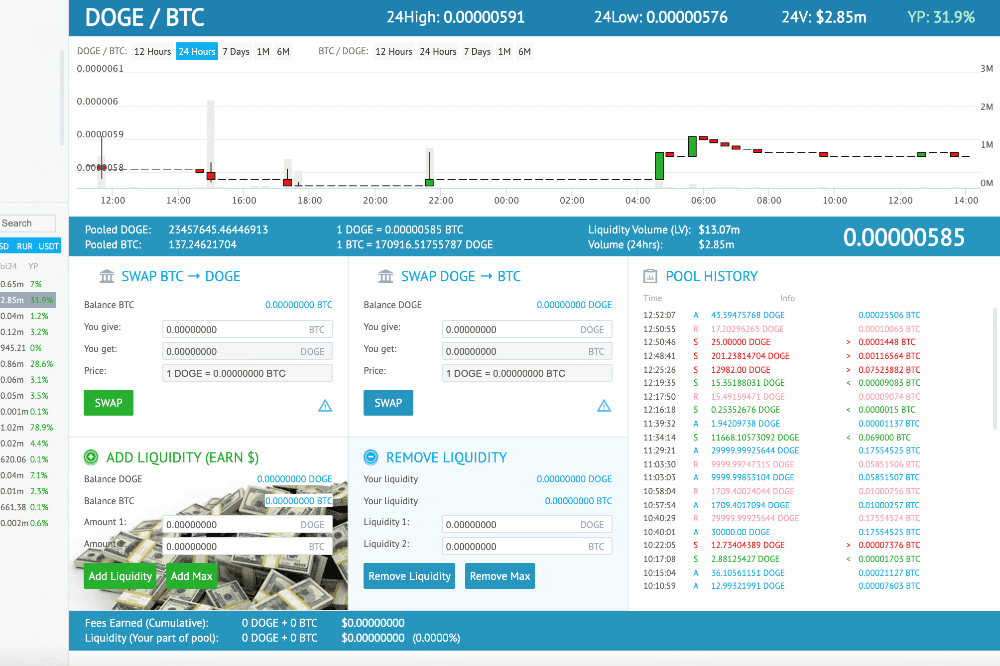

# YoBit.net

尤比特。net DeFi是世界著名交易所YoBit.net的CeFi和DeFi工具的组合。该平台提供：
16个流动性池，APY敢达277%
佣金最低的即时掉期
无KYC的法定存款/取款
每日交易竞赛，奖金30000美元
所有操作都由YoBit支持。net CeFi平台，因此它不依赖任何区块链网络，所有交易都非常快速。此外，用户不必支付极高的汽油费。
YoBit DeFi提供了真正的比特币和Dogecoin，而不是包装的合成资产。

