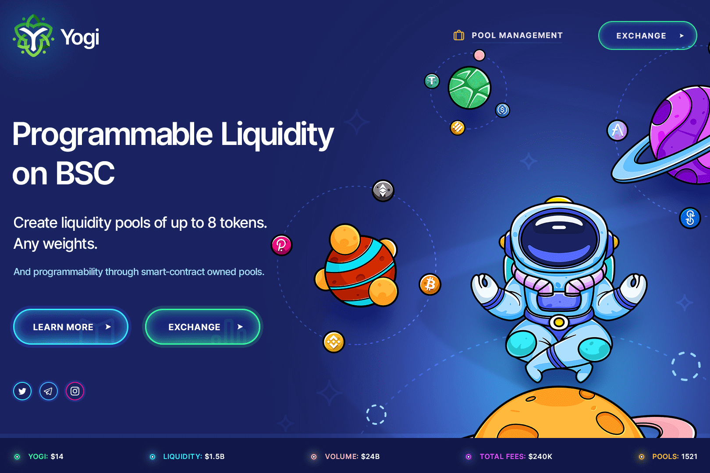

# Yogi - BSC

Yogi 是一个自动化的投资组合经理、流动性提供者和价格传感器。
Yogi 颠覆了指数基金的概念：您无需向投资组合经理支付费用以重新平衡您的投资组合，而是向交易员收取费用，他们通过跟踪套利机会重新平衡您的投资组合。
Yogi 基于 N 维不变表面的 Balancer 实现，它是 Vitalik Buterin 描述的常数乘积公式的推广，并被流行的 Uniswap dapp 证明是可行的。自动化的投资组合经理、流动性提供者和价格传感器。该数据代表被跟踪智能合约的原始链上活动

