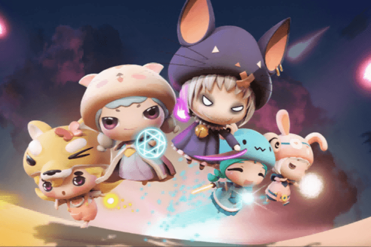

# YoHero

YoHero是基于币安智能链（BSC）开发的Axie Infinity 2.0元界世界。在YoHero元界中，玩家可以通过提升YOLO、加入YOLO的战斗和召唤来享受娱乐和收益。YoHero元界承载了不同的用户群体和社区 文化和每个YOLO都有独特的身份，具有很高的收藏价值。 YoHero元界构建了一个“边玩边赚”的数字世界，货币资产、社交方式、社交形态都实现了。旨在为全球20亿潜在人才提供公平公正的P2E（play to Earn）模式。 一种全新的实现链上娱乐业务的方式，帮助现实世界中的闲散劳动力在GameFi中“再就业”。
YoHero元界建立了分享奖励机制和销毁通缩机制，是P2E（play to Earn）模式下最具可玩性和盈利性的GameFi产品。

