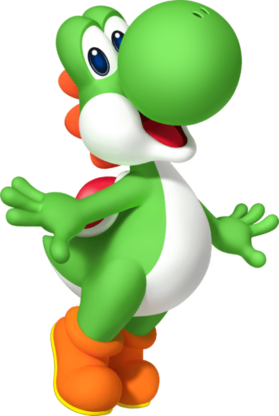

# YooShi

YooShi Metaverse = NFTs + GameFi Launchpad + YooShi IP Creative + Charity。
YooShi NFT 营销包括 NFT 交易市场和 NFT 拍卖市场。YooShi NFT 拍卖功能独特而有趣。 拍卖作品发布时，每次新出价必须比前一出价溢价10%，其中2%由前一投标人获得，8%由拍卖发布者获得。 这意味着，只要你参与拍卖，要么获得拍卖品，要么获得收益，在 YooShi NFT 拍卖市场上没有人会空手而归。这不是升起 d Metoken te Glow Into Yoshi 的 meme merse。 Yoshimeta Erse = NFTs + Gamefie Unchpad + Yoshii PC Reality + Charity。

