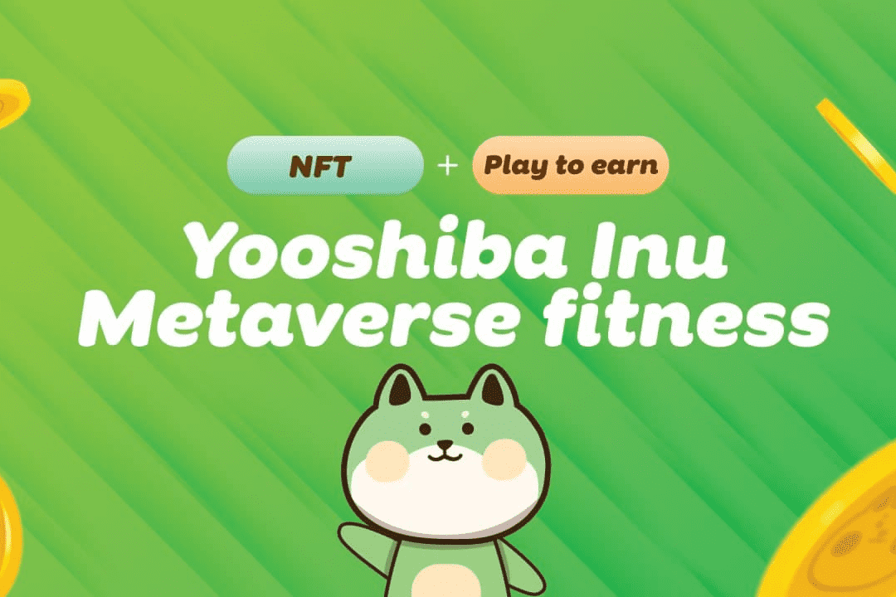

# Yooshiba Inu

Yooshiba Inu ($YSHIBAINU) 是币安智能链下的 BEP-20 代币。 一种超通缩代币，每笔交易（购买、出售和转让）征收 10% 的税，其中 5% 的税进入流动资金池。 合约的回购销毁功能保证了代币价格下限稳定为税收的3%，一旦累积回购金额（TBA），自动发送到销毁地址，同时将分配的代币发送到营销钱包。 剩余的 2% 将根据其持有百分比分配给代币持有者。Yooshiba Inu ($YSHIBAINU) 是一种 meme 硬币，专为 Yooshiba 的游戏而创建，以赚取 NFT 游戏。

