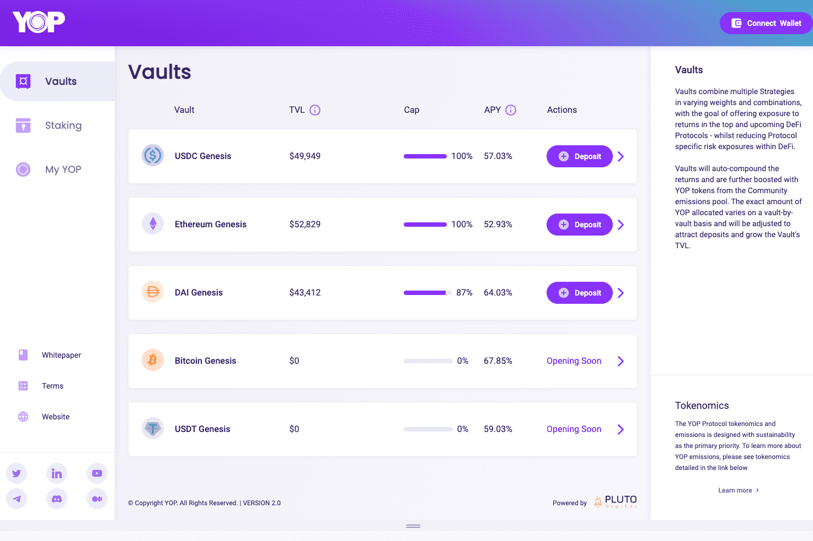

# YOP

收益优化平台 (YOP) 使您能够通过一个干净、简单、教育和易于使用的应用程序与顶级区块链上的最佳 DeFi 协议进行交互。直观的用户界面使 YOP 成为市场上最容易访问的 DeFi 协议。从关于 YOP 性能和用于产生收益的 DeFi 协议生态系统的详细故障和历史数据中，准确了解您的收益是如何以及在何处产生的。从单个界面获得跨多个区块链的多个协议的接触。我们管理多元化并降低风险，因此您不必这样做。
YOP 协议的核心是保险库、策略和治理机制。
策略——这些可以被认为是与一个或多个 DeFi 协议交互以产生收益的构建块。策略可以分层多个协议以产生更高的产量。与目标 DeFi 协议交互的所有方面，从存款、申领、再投资、提款，都是完全自动化的，并被编码在策略中。
Vaults - Vaults 结合一个或多个策略来创造一个混合/多元化的投资机会。这些保险库根据使用的策略和每个策略的分配百分比提供可变的 APY。
治理 - 治理系统控制协议的配置和执行方式。这包括费率、社区排放分配以及新保险库和策略的创建等内容。
YOP Lock Box (Staking) - Staking 是一种让您的 YOP 代币发挥作用并获得奖励的方式。通过“锁定”或使用 Lock Box 质押您的 YOP 代币，您正在帮助减少循环供应，从而加强 YOP 协议。

