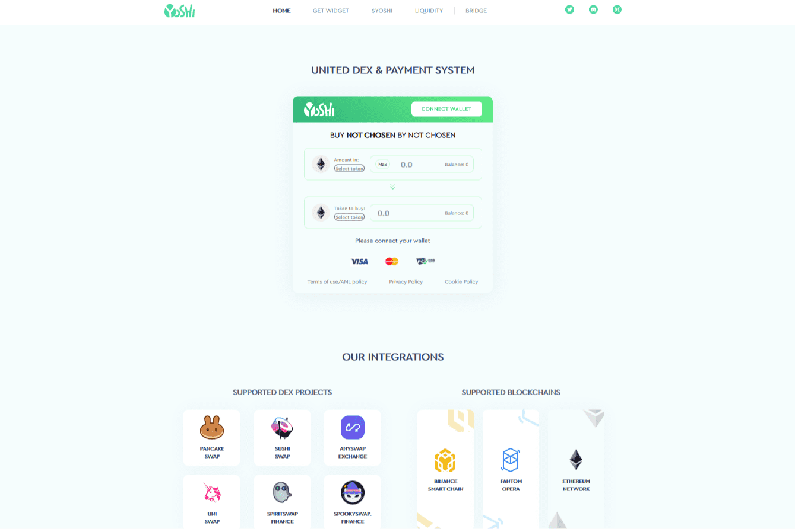

# Yoshi Exchange

吉。exchange（以下简称“Yoshi”）是一个基于Fantom区块链的DEX聚合器
它从与我们合作的DEX es中获取交易，以允许我们的用户利用最低的差价和滑动，同时也为整个网络增加流动性，因为人们追求最佳交易，因此被激励更频繁地这样做。
除了在其原生Fantom网络上提供交易外，Yoshi还提供以太坊和BSC网络上的交换。
此外，我们的原生$YOSHI代币目前在Fantom上可用，很快也将在BSC上可用
2021 12月，Yoshi增加了连接Fantom、BSC和以太坊网络的能力。桥梁由Anyswap供电。
在2021 12月9日撰写本文时，Yoshi正在积极开发坡道上的菲亚特集成，这将允许真正的加密新手直接用银行卡购买代币
此外，为了进一步提高新手的体验，Yoshi正在努力推出自己的非托管钱包，这将允许用户直接通过钱包界面用卡购买加密货币。

