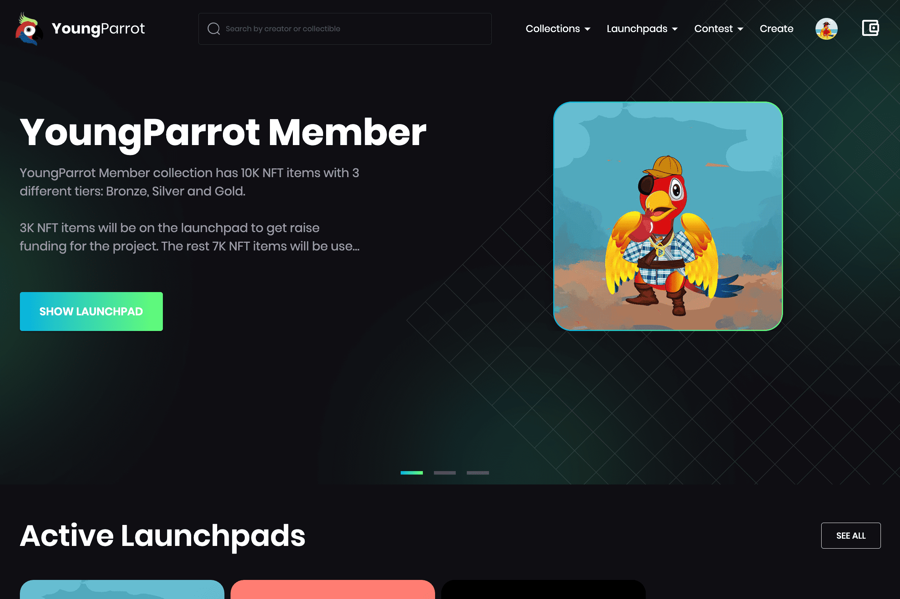

# YoungParrot

YoungParrot 是 Bitgert 链上的 NFT 市场，BRC20。我们将允许用户创建账户、创建收藏、开始上传 NFT 和出售/购买 NFT。用户可以将任何 NFT 添加到关注列表，将任何 NFT 共享到社交网络，根据价格和其他属性过滤 NFT 等。
YoungParrot 拥有会员收藏，允许早期投资者每两周质押 YPC 代币以赚取 YoungParrot NFT，并质押 YoungParrot 会员 NFT 以每月甚至更多时间赚取 YoungParrot NFT。 YoungParrot 会员 NFT 将有 3 个不同的等级：青铜、白银和黄金全息 NFT。
YoungParrot 还具有启动板，允许创建者进行 NFT 启动板，购买者持有 YoungParrot 会员 NFT 将获得 20% 的折扣。
YPC 代币将用于允许用户访问 YoungParrot NFT 市场分析工具，质押以获得 Brise 代币、YPC 代币和 YoungParrot 会员 NFT，参加了我们的月度竞赛。
我们将支持 NFT 市场的多链，并在未来拥有元界。

