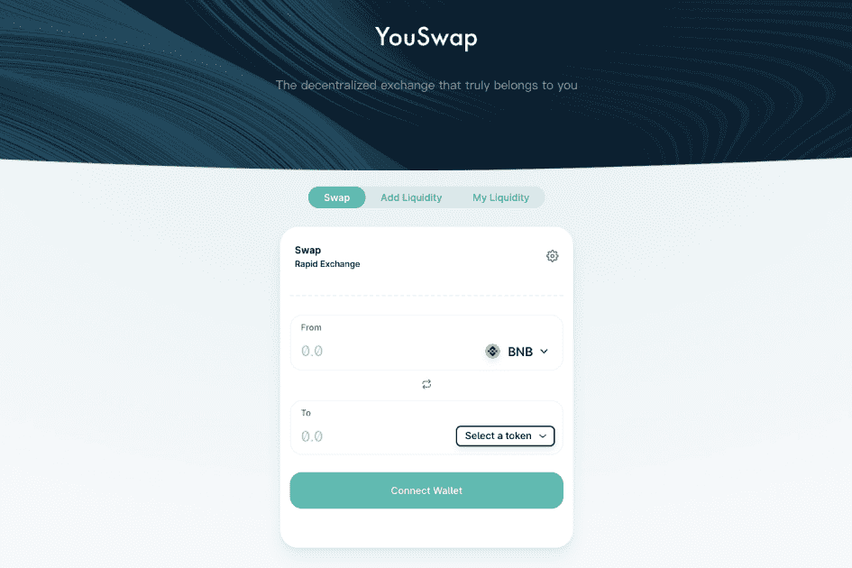

# YouSwap

YouSwap 是新一代的链上中心化交易平台。它通过构建多链部署系统实现数字资产的多链共享，并通过Oracle的价格馈送机制优化AMM模型。同时，多链聚合交易功能可以实现最优价格、低滑点的兑换需求。公链性能扩容前期采用ZK rollup的layer2扩容方案。与其他去中心化交易平台相比，Youswap 具有资金利用率高、滑点低、无常损失风险敞口小、实时交易速度快、gas 成本低等优势。

YouSwap是全球首个以“YOU系列”为价值品牌、具备全生态DEX完备解决方案的交易平台，更是追求区块链本真的一站式去中心化数字资产服务平台。其创始团队为来自新加坡投行或科技公司的金融精英和区块链极客，在云计算、SAAS、区块链技术和网络安全防护等领域拥有丰富的技能，专注研发去中心化跨链技术实现四链一体的智能场景，打造多链原生资产的无缝兑换互操应用，致力于将YouSwap打造为DEX去中心化交易所的标杆，一步到位，解决目前DEX交易所功能单一、用户体验不佳、手续费高等行业痛点。

