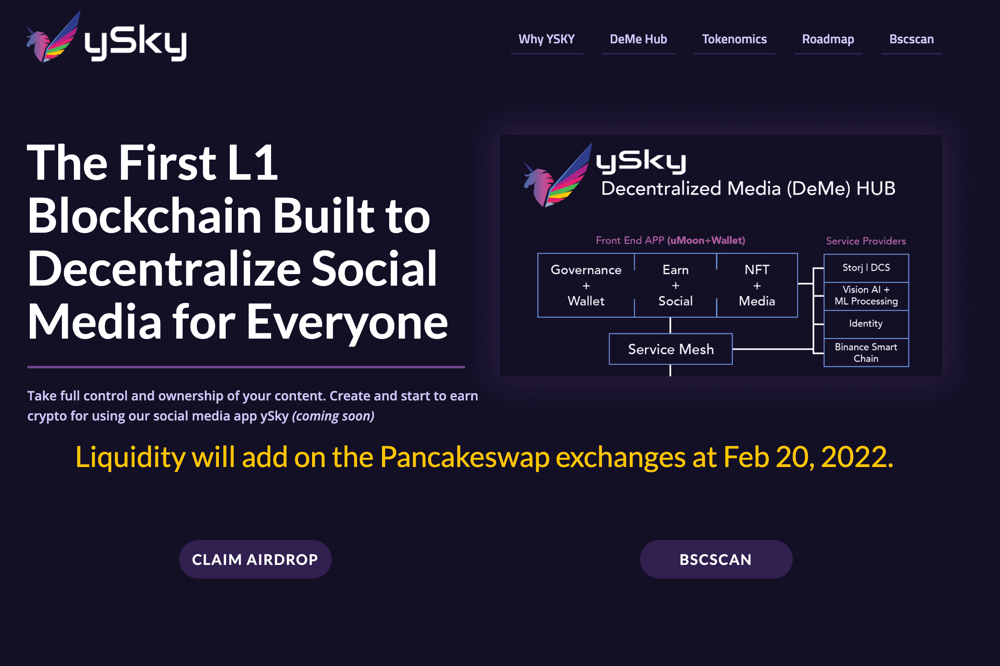

# YSKY-Airdrop

完全控制和拥有您的内容。使用我们的社交媒体应用程序 ySky 创建并开始赚取加密货币。
YSKY 正在智能链上进行代币化！拥有一个实用程序 + 治理代币至关重要，它让所有持有者不仅有机会通过使用代币来释放价值，而且还有助于塑造生态系统和网络的未来。
上市价格 1 YSKY = $ 1.5
流动性将于 2022 年 2 月 20 日加入 Pancakeswap 交易所。
邀请人们在每次空投和预售中获得 100% YSKY

YSKY-Airdrop 是一个 DeFi 协议。它基于币安智能链。您可以通过参与获得利润。作为代币的持有者，您可以参与决策过程，并决定项目的未来。

