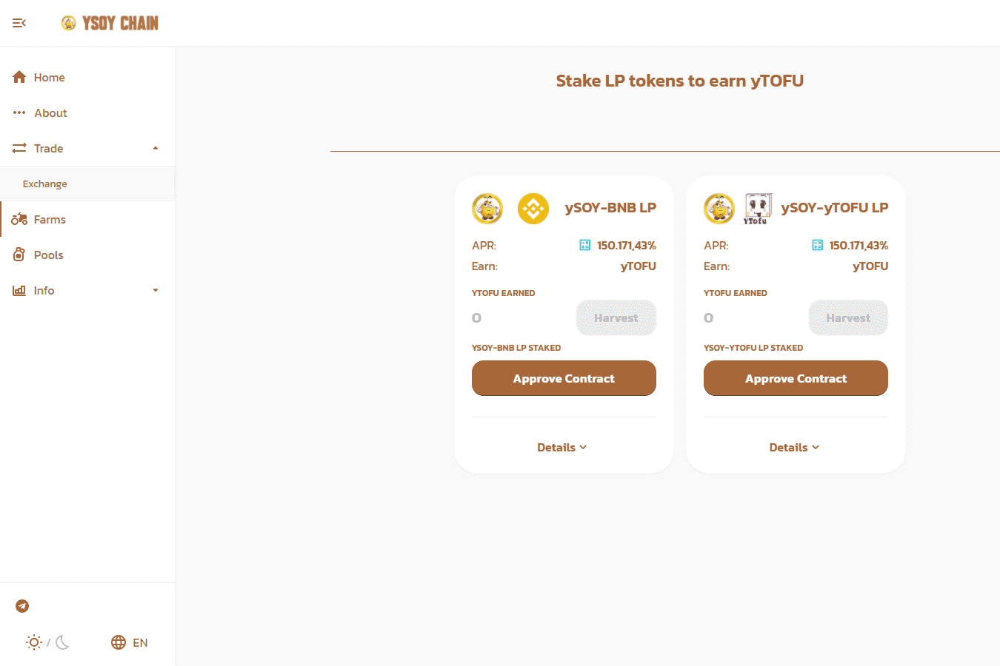

# Ysoy Chain farm

Ysoy 令牌 (Ysoy?)

Ysoy没有采矿过程。Ysoy 的总固定供应量为 10000 YsoY 代币。Ysoy 代币协议由一组非竞争性、可互操作、去中心化和智能合约组成，这些合约由区块链币安系统形成，为 DeFi 开发提供构建块。Ysoychain 项目支持将 BINANCE 与 DEFi 产品经济连接到 DeFi 市场和其他区块链系统的增长的桥梁。它是第一款基于 BNB 智能协议合约的产品。唯一一个生成 3 种资产的资产，这使得它与同一 FARM / DEFI 细分市场中的其他项目不同。YSoy 代币的代表在整个生态系统中创造收入。BEP-20 代币 (ySoy)。Ysoy 它是工厂的激活令牌。在 BNB 上分配的所有 Ysoy 都会生成升序代币 yTofu、ySoymilk、yTOFU ySoy Milk ysoybean oil

