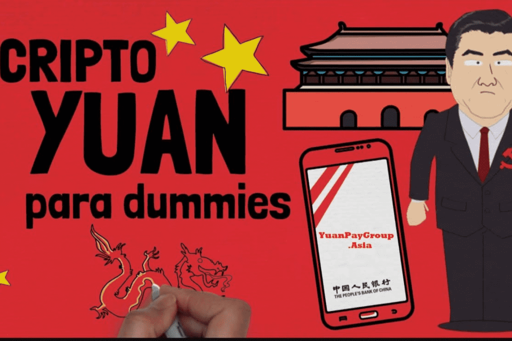

# YuanPay Group

元支付集团是2021年中国的国家加密货币！营销元支付集团代币！元付集团是中国乃至全球领先的中国加密货币管理和钱包组织
经过非常有才华的人的大量辛勤工作以及与中国政府的密切合作，该货币现已准备好发行！自 2021 年 9 月 11 日起，任何人都可以交易中国新的数字人民币加密货币硬币。
截至目前，元支付集团是中国唯一一家获得批准和合法交易和销售加密货币的公司，尤其是这种加密货币，因为它具有国家支持的性质。截至 2021 年 9 月，中国宣布禁止销售或交换任何 ICO 或加密货币，即使是交换也是违法的。现在这种情况正在发生变化，而这种新硬币就是原因。
我们是中国唯一官方批准和控制的合法加密平台。元付集团成立于 2010 年，从那时起，我们一直与银行和其他组织合作，使中国的加密货币交易合法化，并发展与外部投资者的关系。
我们很自豪地宣布，我们被选中管理和组织中国的硬币销售，以支持这一最新的加密货币发展。这是多年努力的结果，但中国的金融基础设施即将永远改变。

