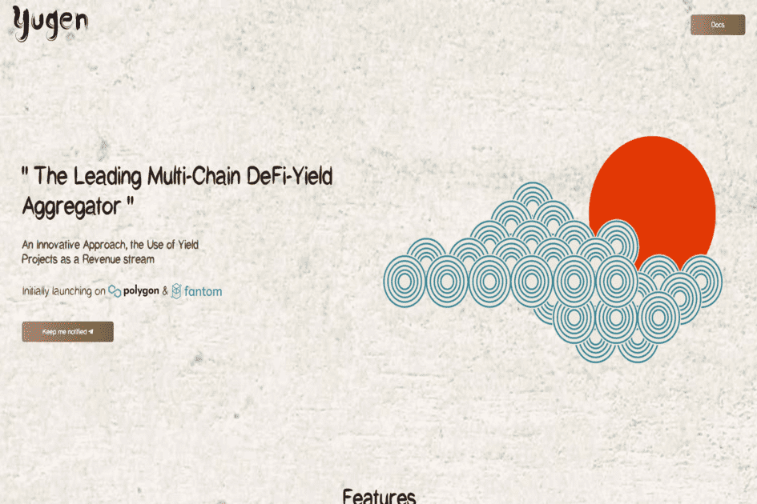

# Yugen Finance

Yugen Finance 是一个 DeFi-Yield 聚合器，通过聚合各种举措的收入来产生资金。该平台还附带一个可在桌面和移动平台上使用的基本应用程序。这使得 Yugen Finance 成为第一个通过其他平台赚钱的 DeFi 回报聚合器。 Yugen Finance 将流动性提供者硬币放置在多个农场的 Fantom、Avalanche 和 Harmony 区块链上。 Yield Farming 项目的农场代币用于购买 $YGN 代币，然后将其作为农场代币和质押激励进行分发。除了主游戏外，还可以访问保险库和迷你游戏。

