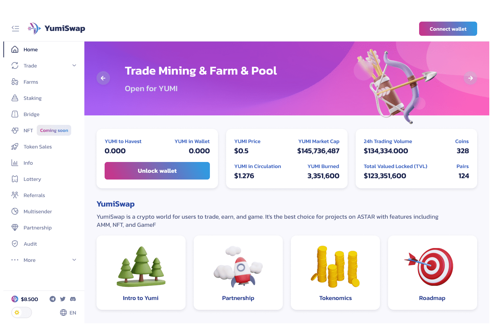

# YumiSwap

即时交换代币：无需注册或账户。只需连接您的 MetaMask 钱包即可。
YumiSwap 是一个供用户交易、赚钱和游戏的加密世界。它是 ASTAR 上具有 AMM、NFT 和 GameFi 等功能的项目的最佳选择。
- 作为投资者
  YumiSwap 不仅通过交易和农业为用户带来好处，还通过 NFT、GameFi 和我们自己的 YumiPad (Launchdpad) 推出的巨大潜力新项目为用户带来利润机会。此外，您将通过贸易采矿获得免费的 Yumi。

- 作为项目合作伙伴
  YumiSwap 将提供所有 DEXes Amms 中最好的支持。 YumiSwap支持包括社区支持、营销支持、成长基金、套利支持、资源对接等。

- 贸易

- 较低的费用
  YumiSwap 在 ASTAR 网络上运行，这是一个交易成本低于其他 EVM 区块链的区块链。

- 去中心化
  与 Binance 等中心化交易所不同，YumiSwap 不会在您交易时持有您的资金：您拥有代币 100% 的所有权，并且可以直接从您的钱包进行交易。

- 通过贸易挖矿赚取 YUMI
  在 YumiSwap 上兑换任何代币，您将获得 YUMI 作为每笔交易的奖励。

- 通过 Yield Farms 赚取 YUMI
  质押LP代币赚取YUMI。您可以通过在流动性池 (LP) 中质押代币来获得 LP 代币。

- 通过质押池赚取代币
  质押 xYUMI 以赚取免费代币。

- 赚取交易费
  与其他 AMM 去中心化交易所一样，您可以在将代币投入流动性池 (LP) 时赚取交易费。

  
