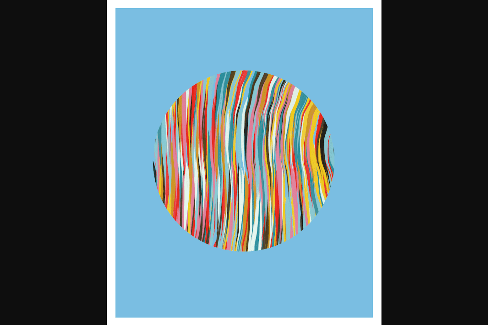

# Z-Huge by MountVitruvius

Z-huge 是我的第一个区块链项目。以诸葛亮的机器牛命名。
让这项工作的每一个输出都感觉特别，同时从相同的代码无休止地生成，这是一个真正的挑战。对于之前的生成式工作，我会生成数百个并且只选择少数几个输出，但是对于这个项目，我真的希望每个输出都感觉是手工制作的。
为了实现这一点，花在这项工作上的大部分时间都用于细化价值观在生成过程中可以探索的界限。有时感觉很像雕刻，探索种子价值和感觉良好的属性组合，然后为一代人探索建立限制。
每一枚薄荷糖都是独一无二的，每枚薄荷糖本身都是不可替代的。即使可以访问源代码，再次使用相同的种子值也会产生独特的变化，这意味着每个输出都是完全（高度熵）唯一的。
一旦这512部全部售出，就不会再有Z-huge作品了。
在过去的几个月里，我一直对这个过程的输出感到惊讶，我希望你喜欢它们。

