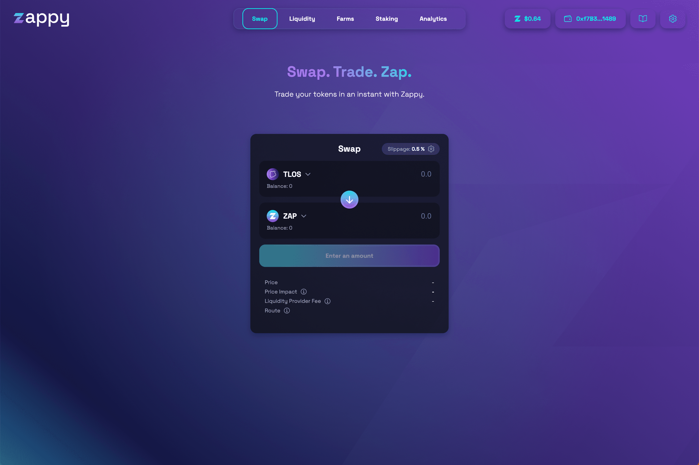

# Zappy

Zappy 是 Telos 网络的自动做市 (AMM) 去中心化交易所 (DEX)。 Zappy 正在 Telos 上为 DeFi 构建一站式生态系统，从 DEX 本身、ZAP 治理令牌和多样化的收益农业机会开始。在 24 小时内，Zappy 积累了最多的碱基对流动性，所有 Telos DEX 中最高的 24 小时交易量，以及 TelosEVM 上最大的市值。
特征：
🔁 交换在 TelosEVM 上即时交换代币，受益于最佳流动性和最低交易费用
🚜 Farm Stake LP 代币在我们的农场中并获得 ZAP 奖励
⚡️ Stake Stake ZAP 代币，通过从协议费用产生的回购来赚取更多 ZAP 代币
🏦 治理（即将推出）通过持有 ZAP 代币对 Zappy 提案进行投票
💰 借贷（即将推出） 通过 Zappy 的去中心化借贷协议借贷

