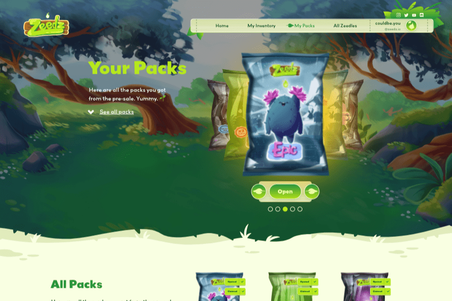

# Zeedz

气候变化已成为现实——现在是采取行动的时候了。到 2050 年，世界必须实现碳中和。这是我们保护地球的唯一机会——对于我们和未来的每一代人。
想象一下您最喜欢的童年怪物收藏游戏的更环保、真正有意义的版本，在其中升级您的小动物会为现实世界的气候保护项目提供资金。
多亏了区块链和 NFT 技术，你拥有那个小生物（你的 Zeedle），而不是创造游戏的大公司。您可以随心所欲地成长、发展和定制它，并通过这样做显着增加它的价值。然后你可以卖掉它并重新开始，或者干脆永远保留它并收集更多。
是的，你在做所有这些事情的同时积极地拯救地球。以前玩过这样的东西吗？
100
Zeedz 是第一款以游戏为目的的游戏，它不仅为非营利组织提供财政捐助，而且还广泛宣传全球变暖并积极鼓励可持续的生活方式，将游戏中的挑战与现实世界的天气现象和教育内容联系起来。

