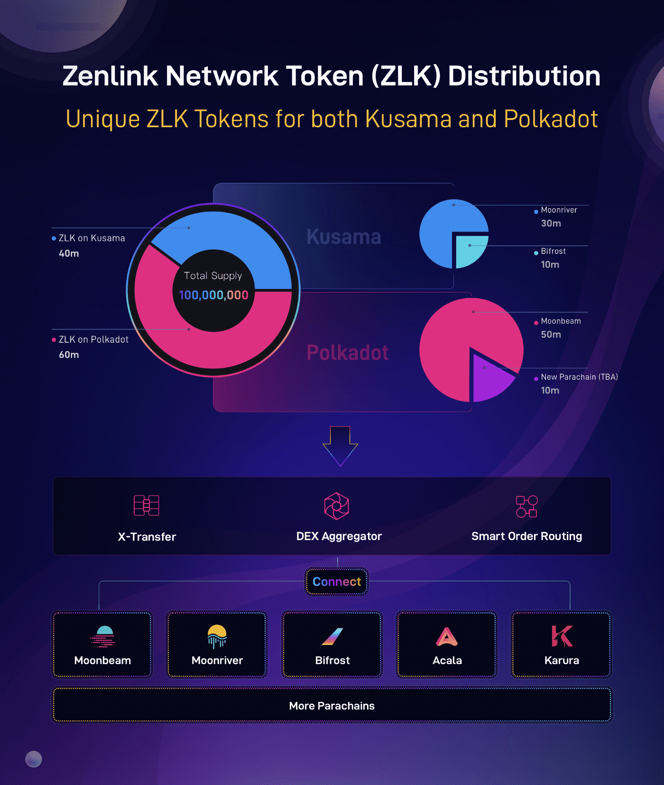

# Zenlink

Zenlink 是基于 Polkadot 的底层跨链 DEX 协议，致力于成为 Polkadot 的 DEX 可组合枢纽。 Zenlink DEX 协议通过接入基于 Substrate 的终极、开放、通用的跨链 DEX 协议，使所有平行链能够一键构建 DEX 并实现流动性共享。 Zenlink DEX 协议包括 Module、WASM 和 EVM 实现，它们灵活且适应性强，允许可定制的组合以及与不同 DeFi 模块的互操作性。
此外，Zenlink DEX Aggregator 连接波卡上所有 DEX DApp，聚合流动性，为用户提供低滑点的交易体验。 Zenlink DEX Composable Hub 让开发者可以访问 Zenlink DEX 模块来构建自己独特的 DEX，形成 Polkadot 生态系统的 DEX 可组合中心。
Zenlink已获得Alameda Research、Hashkey、IOSG、OKEx等知名机构的2轮Web3基金会资助和投资。

