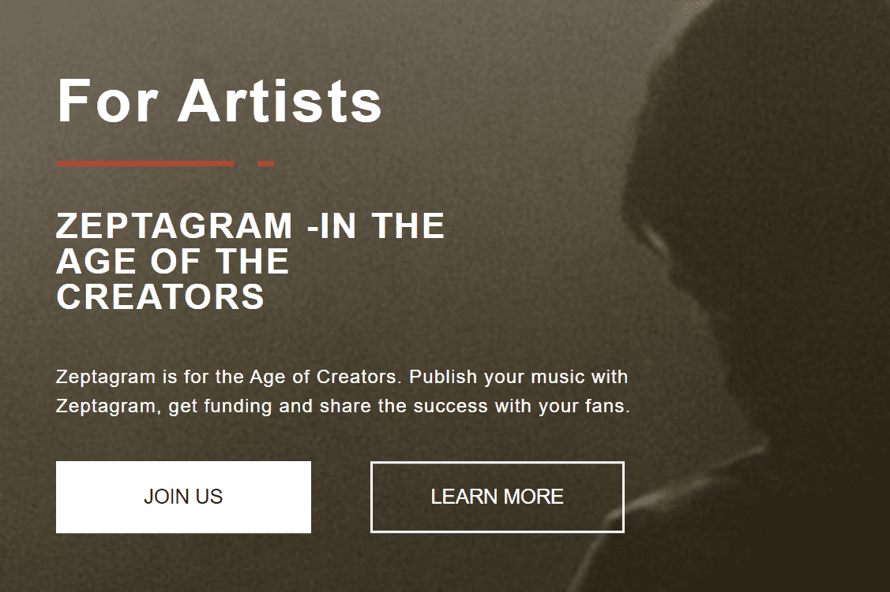

# Zeptagram

Zeptagram 是一个基于区块链的交易平台，知识产权所有者可以将他们的资产标记为 NFT 和 dNFT。 Zeptagram 的目标是成为领先的音乐和知识产权交易交易所。早期投资者有机会以极具吸引力的价格投资限量版的平台货币 Zeptacoin。 Zeptagram 使艺术家可以为他们的创作提供资金并列出他们的音乐权利。音乐迷和投资者可以投资音乐版权，并在音乐在广播、电视、Spotify 和 Youtube 上播放或在电影中使用时获得回报。有了 Zeptagram，投资音乐版权就像投资股票一样简单。基于区块链的平台可以安全、轻松地跟踪音乐权利并将版税收入分配给平台上列出的音乐权利所有者。该平台可用作适用于 Android 和 iOS 的 Web 平台和移动平台。 Zeptacoin 将成为交易平台上的主要货币。

