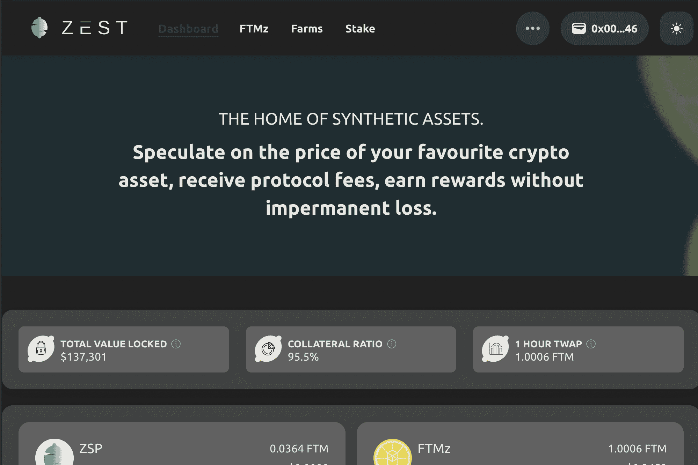

# Zest Protocol

Zest Protocol 使用三种不同的代币来允许用户投机基础资产，同时获得被动收入。
ZSP（Zest 合成协议令牌）
ZPS 是 Zest 协议实用代币，参与者通过该代币获得协议产生的费用收入。
FTM（幻想）
Fantom Opera 网络上我们都知道和喜爱的代币。
FTMz（合成幻象）
FTM 代币的合成版本与 FTM 价格 1:1 挂钩。
Zest 协议如何运作以及不同的代币有什么作用？
为了铸造 FTMz 代币，用户必须将 FTM 存入 Zest 协议。这个 FTM 然后成为 FTMz 的抵押品，作为回报，协议为您提供 FTMz。
使用 FTMz，您可以推测 FTM 的价格行为并利用套利机会。此外，您可以通过将 FTM 与 FTMz 配对并将 LP 代币存入 Zest 的农场来赚取 APR。
使用我们的农场，您不会遭受任何重大的无常损失，但获得的 APR 比当前的 FTM 单一抵押机会高得多。
耕作的回报可以被锁定或质押，进一步增加您通过使用 Zest 协议获得的 APR。
什么是 FTMz？
FTM 代币的合成版本与 FTM 价格 1:1 挂钩，由至少 90% 的抵押品支持（在任何给定时间可能更多）并通过算法进行控制。
什么是合成代币？
在 DeFi 领域，“合成代币”阶段意味着有抵押品支持的代币，其中代币的价值变化等于固定参考。

