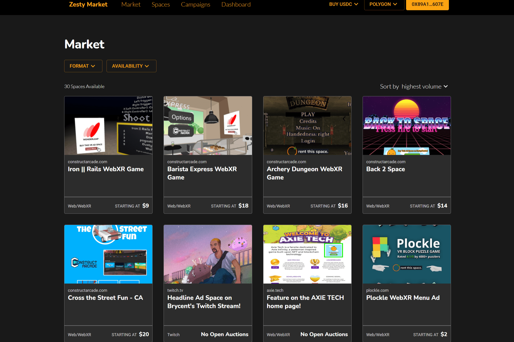

# Zesty Market

Zesty Market 实现了虚拟世界中数字空间的货币化。
作为创作者，您可以铸造代表网站、直播或游戏中的数字横幅的 NFT。
广告商可以租用 NFT 以获得修改出现在环境中的图像资产的能力。

Zesty 最初是 WebXR 开发人员通过其体验获利的一种简单方式。Zesty 今天正在成为一种公共产品，开发人员可以依靠它来保持元宇宙更加开放，尊重参与者的隐私，并且不会将用户数据孤立在私人服务器中。

