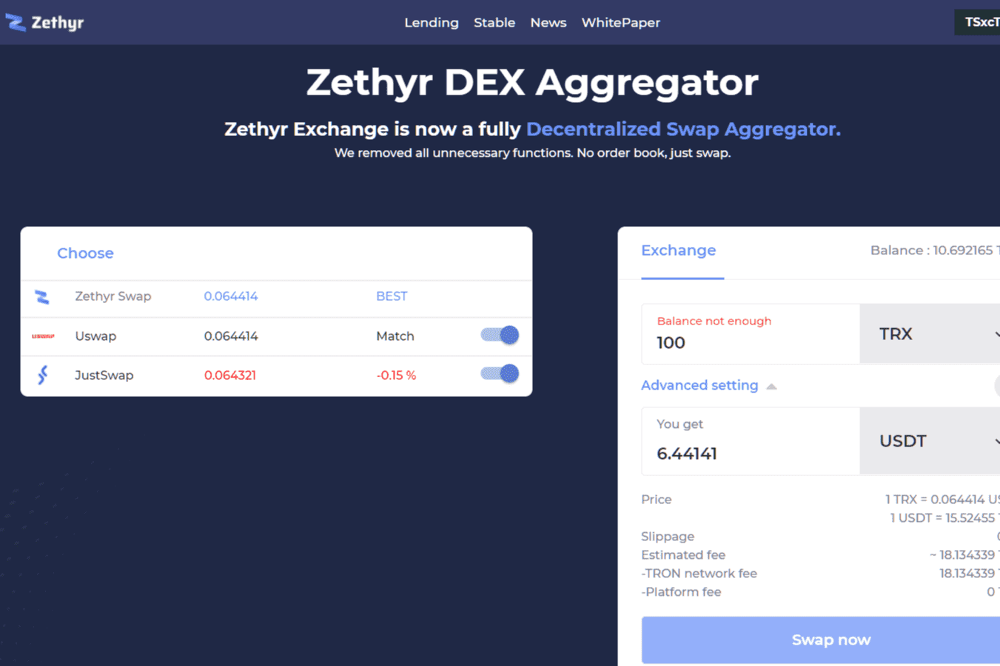

# Zethyr DEX Aggregator

Zethyr DEX 聚合器是一个完全去中心化的应用程序，它聚合不同的 DEX 和掉期以提供最佳汇率。立即以最优惠的价格、零费用交换 TRON 代币。

Zethyr DEX Aggregator 是一个用于交换基于 TRON 的代币的 DEX。它是完全去中心化的。它使用户能够立即免费交换 TRON 代币。此外，Zethyr 聚合了几个掉期和 DEX 以提供优越的汇率。它在 TRON 上运行。

Zethyr DEX Aggregator dApp 是基于Tron协议构建的交易所类别的加密资产。现在，根据用户数量，它在一般 dApp 排名中排名第 869位，在Exchanges类别中排名第 51位，这让您可以很好地了解Zethyr DEX Aggregator dApp 在其竞争对手中的表现。

