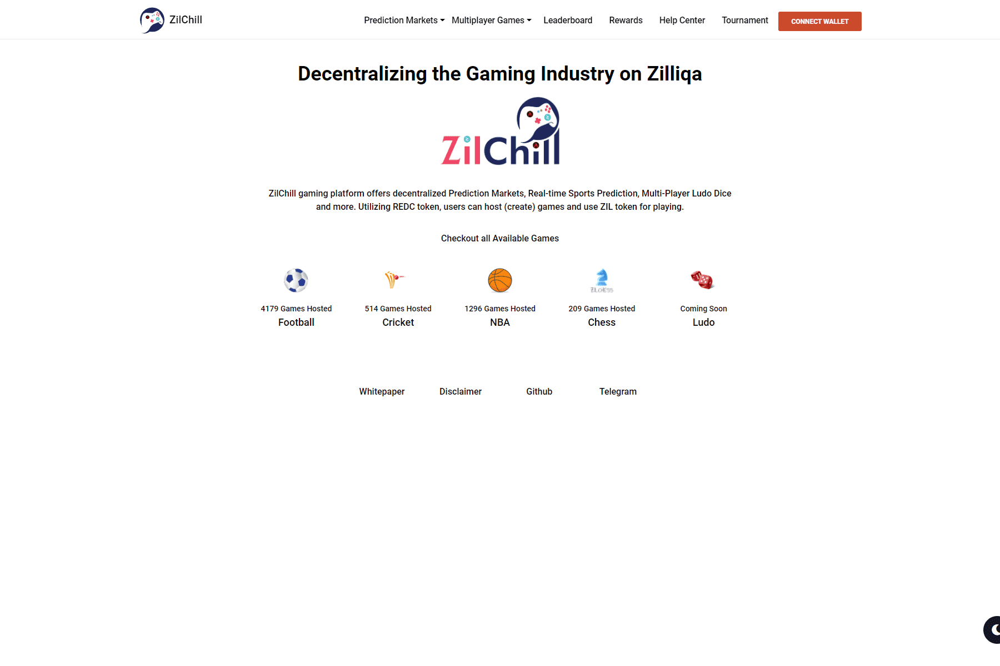

# ZilChill

ZilChill 游戏平台提供去中心化预测市场、实时体育预测、多人 Ludo Dice 等。利用 REDC 代币，用户可以托管（创建）游戏并使用 ZIL 代币进行游戏。

ZilChill由RedChillies团队为您带来，是一个一站式游戏平台，允许用户参与多人游戏，通过原生预测DEX进行体育游戏预测，借贷和借贷抵押品，并赚取游戏收藏品！

ZilChill平台目前支持多人游戏，包括Chess和Ludo Dice（后者将于2022年1月的第一周推出），并支持更多的互动游戏，如Skribble，Hangman，Slither，ClashRoyale或MortalCombat。每个游戏都将在无许可的情况下创建，任何人都可以加入。

