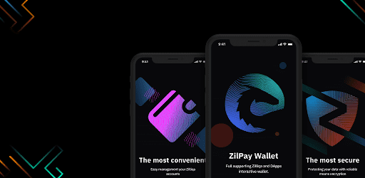

# ZilPay Wallet

ZilPay Wallet 是 zilliqa 区块链上的开源钱包去中心化应用程序。生态系统中的每个 Dapp 都从 ZilPay 中受益，因为它们围绕它构建

用于 zilliqa 区块链的 ZilPay 浏览器扩展
该扩展将 Zilliqa web3 API 注入到每个网站的 javascript 上下文中，以便 dapps 可以从区块链中读取。

ZilPay 还允许用户创建和管理自己的身份（通过私钥、本地客户端钱包和 Ledger 等硬件钱包），因此当 Dapp 想要执行交易并写入区块链时，用户可以获得一个安全界面来查看交易，在批准或拒绝之前。

因为它向普通浏览器上下文添加了功能，所以 ZilPay 需要读取和写入任何网页的权限。你可以像做任何 Chrome 扩展一样“查看源代码”，或者在 Github 上查看源代码：https://github.com/zilpay/zil-pay

