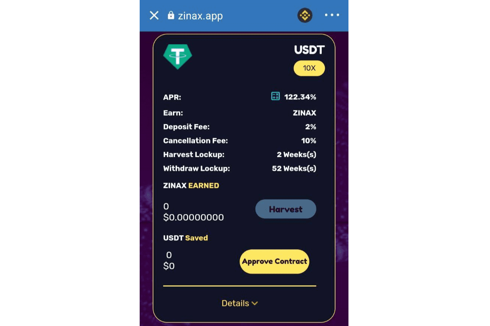

# Zinax DAO

ZinaX 是一个建立在区块链上的高收益储蓄和投资平台。 ZinaX 使您能够节省加密资产的资金。这些储蓄和投资选择使您能够从股息和利息中获得被动收入。
ZinaX 由 Zinari Finance 构建，但目前作为去中心化自治组织 (DAO) 运营。
ZinaX 目前提供以下功能：

  高收益质押池
  高产农场

自 2022 年 1 月推出以来，ZinaX 平台的价值已超过 20 万美元。

在 ZinaX 上储蓄类似于在银行储蓄。核心区别在于在您拥有的银行中储蓄。您有权决定利率、费用、期限以及对您的资金制定规则。ZinaX 不控制您的资金，您是唯一控制您资金的人

