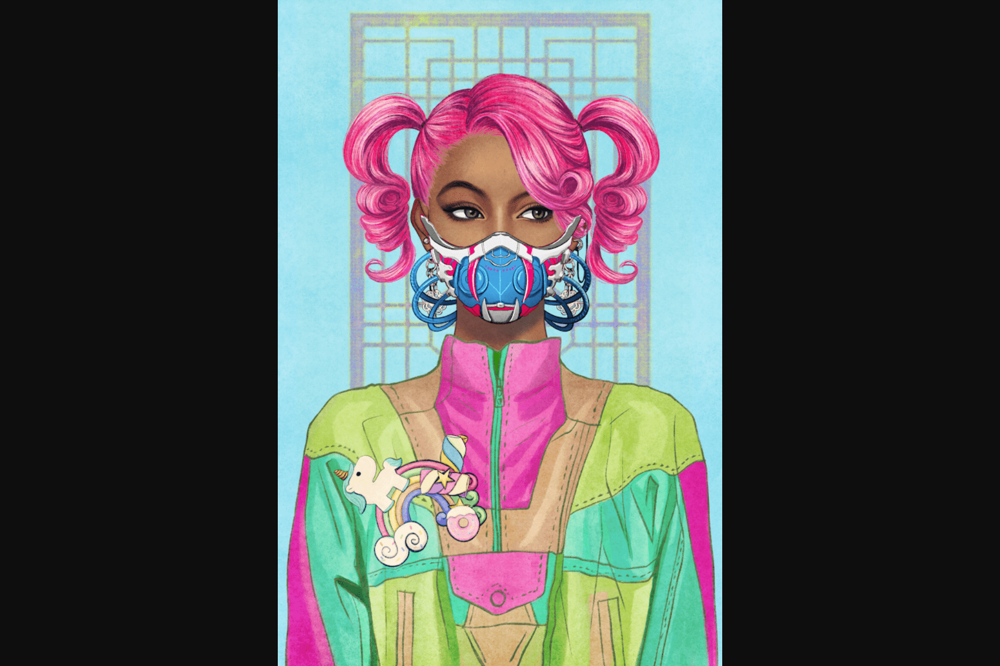

# Zipcy's SuperNormal

Zipcy 是 8,888 个生成 NFT，通过描绘多样化和独特的元素并包含各种人类身份和情感来代表个人主义。 

Zipcy's 由一个 6 人团队组成，包括艺术家、运营、开发人员和网页设计。艺术家Zipcy来自韩国首尔。她是一位插画家，曾为 Netflix 和迪士尼等公司的许多重大项目绘制插图。

Zipcy 的创意作品由六种综合风格组成，涵盖了人类的各种身份和情感。该系列旨在通过每件作品的拟人化以及使每个“超正常”的特征来唤起观众对艺术的诠释。SuperNormal 旨在让越来越多的亚洲社区和成员参与 NFT 领域。Zipcy 的 Metaverse (ZMV) 将包括在 Decentraland 购买和开发一个专属庄园，其中将举办 SuperNormal 持有者以及一些公众专属的有趣活动。虽然这个最初的系列是第 1 季，但在第 2 季中，团队将推出一系列新的 SuperNormals，这将是一个包含多达 20,000 枚薄荷糖的系列，其中将引入更多种类的特征。最多8个，888 Han Yak (Korean Potions) 将免费为所有第 1 季持有者申领，其余部分用于预售/公开销售。消费 Han Yak 将允许一个人参与独家时尚游戏，授予用户访问 20-30 个随机的新特性来打扮他们的第 2 季 SuperNormal。该团队还有一个非常令人兴奋的“ZIPS' Merch”计划，专供 SuperNormal 持有者使用。这将是从街头服饰到签名海报的各种产品。

