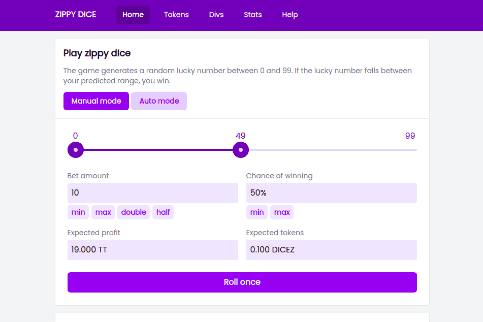

# ZIPPY

Zippy 是建立在 Thundercore 区块链之上的去中心化应用程序集合。 dapps 通过 ZIPPY 令牌连接在一起。用户可以通过收益耕作来铸造 ZIPPY，以获得各种收益。
Zippy dice 是 Zippy 生态系统的第一个 dapp。 Zippy dice 利用 Thundercore 区块链的快速交易和近乎零的费用来实时支持大量投注。玩家可以在玩游戏时铸造有限的供应利润分享 DICEZ 代币。通过冻结 DICEZ 代币，玩家可以拥有房子并通过每日分红获得被动收入。与单产农业相关的多个 dapps 生态系统.

