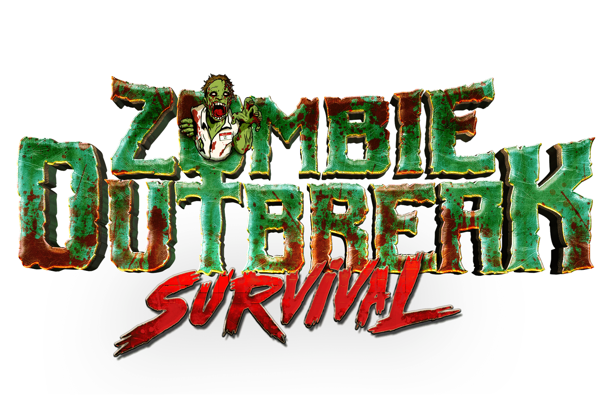

# Zombie Outbreak Survival

ZOS 是一款基于 WAX 区块链的战略性资源管理 MMORPG。

Nitel 镇是世界末日病毒爆发的归零地，控制幸存者在后世界末日的世界中清除、战斗并最终重建。

ZOS 融合了生存游戏类型的坚韧和咬指甲的风险，让玩家拥有游戏内资产并通过区块链技术的力量与其他玩家自由买卖/交易，玩家不仅可以生存而且可以茁壮成长！ ZOS 将为巨型社区与社区战斗提供以公会为中心的游戏模式，巨大的战利品处于危险之中！

目标是建立和准备您的战利品缓存，以在区块链上一些最大和最史诗般的战斗中支持您的盟友幸存者！..在区块链内外产生广泛影响的战斗！

非常适合喜欢 Eve Online、Runescape、魔兽世界、命运和其他 MMORPG 游戏等游戏的玩家

